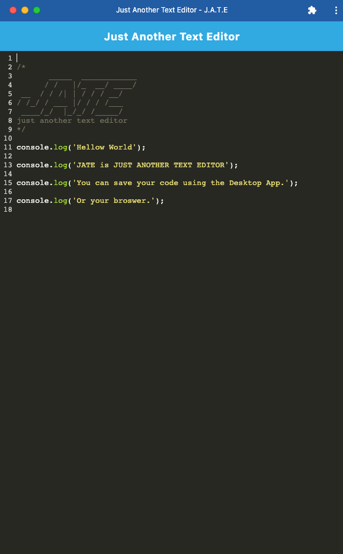
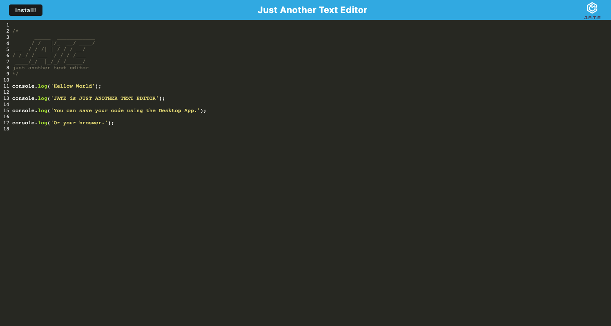

# Text Editor PWA

## Description

This PWA text editor is designed for users who need a way to save text or code snippets in an app running in a browser window or on a desktop. The app is bundled using Webpack and deployed on Heroku.

---

## App functionality

GIVEN a text editor web application

WHEN users open the text editor

THEN IndexedDB immediately creates a database storage

WHEN they enter content and subsequently click off of the DOM window

THEN they find that the content in the text editor has been saved with IndexedDB

WHEN they reopen the text editor after closing it

THEN they find that the content in the text editor has been retrieved from the IndexedDB

WHEN they click on the Install button

THEN they download a web application as an icon on a desktop

WHEN they load the web application

THEN they should have a registered service worker using Workbox

WHEN they register a service worker

THEN the static assets are pre-cached upon loading along with subsequent pages and static assets

---

## Table of Contents

  <ul>
    <li>
      <a href="#description">Description</a>
    </li>
    <li>
      <a href="#app-functionality">App functionality</a>
    </li>
    <li>
      <a href="#demo">Demo</a>
    </li>
    <li>
        <a href="#questions">Questions</a>
    </li>
    <li>
        <a href="#acknowledgments">Acknowledgements</a>
    </li>
  </ul>

---

## Demo

You can check out the app following [this link.]()

This screenshot demonstrates the desktop app.

This screenshot demonstrates the app running in a browser window.

---

## Questions

If you have any questions regarding this project, please don't hesitate to contact me using my email address: pomyateevav@gmail.com. You can find my project repositories here: [veronika-pomy](https://github.com/veronika-pomy?tab=repositories).

---

## Acknowledgments

This list includes resources used for the project.

- [Best README Template](https://github.com/othneildrew/Best-README-Template/blob/master/README.md)
- [concurrently](https://www.npmjs.com/package/concurrently)
- [Express](https://expressjs.com/)
- [Heroku](https://devcenter.heroku.com/)
- [idb](https://www.npmjs.com/package/idb)
- [if-env](https://www.npmjs.com/package/if-env)
- [Medium - Service Worker Caching Strategies Based on Request Types](https://medium.com/dev-channel/service-worker-caching-strategies-based-on-request-types-57411dd7652c)
- [mdn- IDBObjectStore - put() method](https://developer.mozilla.org/en-US/docs/Web/API/IDBObjectStore/put)
- [Node.js](https://nodejs.org/en/)
- [nodemon](https://www.npmjs.com/package/nodemon)
- [Stack Overflow - Should I cache manifest json in service worker?](https://stackoverflow.com/questions/45463181/should-i-cache-manifest-json-in-service-worker)
- [Webpack](https://webpack.js.org/)
- [Workbox](https://developer.chrome.com/docs/workbox/)

(<a href="#text-editor-pwa">back to top</a>)

